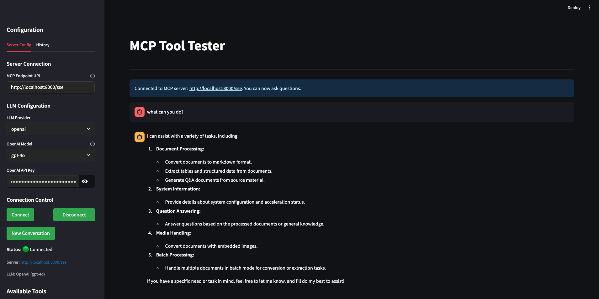

# MCP SSE Client Python

A Python client for interacting with Model Context Protocol (MCP) endpoints using Server-Sent Events (SSE).

## Quick Start

Get up and running in minutes:

```bash
# Clone the repository
git clone https://github.com/zanetworker/mcp-sse-client-python.git
cd mcp-sse-client-python

# Install the package
pip install -e .

# Try the interactive Streamlit app
cd mcp-streamlit-app
pip install -r requirements.txt
streamlit run app.py
```



## What is MCP SSE Client?

This client provides a simple interface for:
- Connecting to MCP endpoints via Server-Sent Events
- Discovering and invoking tools with parameters
- Integrating with LLMs (OpenAI, Anthropic, Ollama) for AI-driven tool selection
- Testing tools interactively through a Streamlit UI

## Core Features

### 1. Simple MCP Client

Easily connect to any MCP endpoint and interact with available tools:

```python
import asyncio
from mcp_sse_client import MCPClient

async def main():
    # Connect to an MCP endpoint with optional timeout and retry settings
    client = MCPClient(
        "http://localhost:8000/sse",
        timeout=30.0,      # Connection timeout in seconds
        max_retries=3      # Maximum retry attempts
    )
    
    # List available tools
    tools = await client.list_tools()
    print(f"Found {len(tools)} tools")
    
    # Invoke a calculator tool
    result = await client.invoke_tool(
        "calculator", 
        {"x": 10, "y": 5, "operation": "add"}
    )
    print(f"Result: {result.content}")  # Output: Result: 15
    print(f"Success: {result.error_code == 0}")

asyncio.run(main())
```

### 2. LLM-Powered Tool Selection

Let AI choose the right tool based on natural language queries:

```python
import os
from mcp_sse_client import MCPClient, OpenAIBridge

# Connect to MCP endpoint and create an LLM bridge
client = MCPClient("http://localhost:8000/sse")
bridge = OpenAIBridge(
    client,
    api_key=os.environ.get("OPENAI_API_KEY"),
    model="gpt-4o"
)

# Process a natural language query
result = await bridge.process_query(
    "Convert this PDF to text: https://example.com/document.pdf"
)

# The LLM automatically selects the appropriate tool and parameters
if result["tool_call"]:
    print(f"Tool: {result['tool_call']['name']}")
    print(f"Result: {result['tool_result'].content}")
```

### 3. Command-Line Interface

The package includes a powerful CLI tool for interactive testing and analysis:

```bash
# Run the CLI tool
python -m mcp_sse_client.examples.llm_example --provider openai --endpoint http://localhost:8000/sse
```

**Configuration Options:**
```
usage: llm_example.py [-h] [--provider {openai,anthropic,ollama}]
                     [--openai-model {gpt-4o,gpt-4-turbo,gpt-4,gpt-3.5-turbo}]
                     [--anthropic-model {claude-3-opus-20240229,claude-3-sonnet-20240229,claude-3-haiku-20240307}]
                     [--ollama-model OLLAMA_MODEL] [--ollama-host OLLAMA_HOST]
                     [--endpoint ENDPOINT] [--openai-key OPENAI_KEY]
                     [--anthropic-key ANTHROPIC_KEY]
```

**Example Output:**
```
Starting MCP-LLM Integration Example...
Connecting to MCP server at: http://localhost:8000/sse
Using OpenAI LLM bridge with model: gpt-4o
Fetching tools from server...

=== Available Tools Summary ===
3 tools available:
  1. calculator: Perform basic arithmetic operations
     Required parameters:
       - x (number): First operand
       - y (number): Second operand
       - operation (string): Operation to perform (add, subtract, multiply, divide)

  2. weather: Get current weather for a location
     Required parameters:
       - location (string): City or location name

  3. convert_document: Convert a document to text
     Required parameters:
       - source (string): URL or file path to the document
     Optional parameters:
       - enable_ocr (boolean): Whether to use OCR for scanned documents

Entering interactive mode. Type 'quit' to exit.

Enter your query: What's the weather in Berlin?

=== User Query ===
What's the weather in Berlin?
Processing query...

=== LLM Reasoning ===
I need to check the weather in Berlin. Looking at the available tools, there's a "weather" tool that can get the current weather for a location. I'll use this tool with "Berlin" as the location parameter.

=== Tool Selection Decision ===
Selected: weather
  Description: Get current weather for a location

  Parameters provided:
    - location (string, required): Berlin
      Description: City or location name

  Query to Tool Mapping:
    Query: "What's the weather in Berlin?"
    Tool: weather
    Key parameters: location

=== Tool Execution Result ===
Success: True
Content: {"temperature": 18.5, "conditions": "Partly cloudy", "humidity": 65, "wind_speed": 12}
```

### 4. Interactive Testing UI

The included Streamlit app provides a comprehensive testing interface with enhanced features:

**Key Features:**
- **Multiple Chat Modes:**
  - **Auto Mode**: LLM automatically decides when to use tools
  - **Chat Mode**: Direct conversation without MCP tools
  - **Tools Mode**: Always attempt to use MCP tools
- **Multi-LLM Support**: OpenAI, Anthropic, and Ollama integration
- **Dynamic Configuration**: Connect to any MCP endpoint with real-time status
- **Tool Discovery**: Automatic detection and display of available tools
- **Beautiful Response Formatting**: Special formatting for structured data (e.g., JIRA issues)
- **Error Handling**: Robust connection management with clear error messages
- **Ollama Integration**: Automatic model detection and selection

**Enhanced UI Features:**
- Real-time connection status indicators
- Expandable tool parameter documentation
- Chat history with proper message formatting
- Configurable timeouts and retry settings
- Debug information for troubleshooting

To run the Streamlit app:
```bash
cd mcp-streamlit-app
pip install -r requirements.txt
streamlit run app.py
```

The app automatically handles event loop management for seamless operation in the Streamlit environment.

## Installation

### From Source

```bash
git clone https://github.com/zanetworker/mcp-sse-client-python.git
cd mcp-sse-client-python
pip install -e .
```

### Using pip (once published)

```bash
pip install mcp-sse-client
```

## Supported LLM Providers

The client supports multiple LLM providers for AI-driven tool selection:

- **OpenAI**: GPT-4o, GPT-4, GPT-3.5-Turbo
- **Anthropic**: Claude 3 Opus, Claude 3 Sonnet, Claude 3 Haiku
- **Ollama**: Llama 3, Mistral, and other locally hosted models

## API Reference

### MCPClient

```python
client = MCPClient(endpoint, timeout=30.0, max_retries=3)
```

**Parameters:**
- `endpoint`: The MCP endpoint URL (must be http or https)
- `timeout`: Connection timeout in seconds (default: 30.0)
- `max_retries`: Maximum number of retry attempts (default: 3)

#### Methods

##### `async list_tools() -> List[ToolDef]`

Lists available tools from the MCP endpoint.

**Raises:**
- `MCPConnectionError`: If connection fails after all retries
- `MCPTimeoutError`: If operation times out

##### `async invoke_tool(tool_name: str, kwargs: Dict[str, Any]) -> ToolInvocationResult`

Invokes a specific tool with parameters.

**Parameters:**
- `tool_name`: Name of the tool to invoke
- `kwargs`: Dictionary of parameters to pass to the tool

**Returns:**
- `ToolInvocationResult` with `content` (str) and `error_code` (int, 0 for success)

**Raises:**
- `MCPConnectionError`: If connection fails after all retries
- `MCPTimeoutError`: If operation times out

##### `async check_connection() -> bool`

Check if the MCP endpoint is reachable.

**Returns:**
- `True` if connection is successful, `False` otherwise

##### `get_endpoint_info() -> Dict[str, Any]`

Get information about the configured endpoint.

**Returns:**
- Dictionary with endpoint information including URL components, timeout, and retry settings

### Error Handling

The client includes robust error handling with specific exception types:

```python
from mcp_sse_client import MCPClient, MCPConnectionError, MCPTimeoutError

try:
    client = MCPClient("http://localhost:8000/sse")
    tools = await client.list_tools()
except MCPConnectionError as e:
    print(f"Connection failed: {e}")
except MCPTimeoutError as e:
    print(f"Operation timed out: {e}")
```

**Exception Types:**
- `MCPConnectionError`: Raised when connection fails after all retry attempts
- `MCPTimeoutError`: Raised when operations exceed the configured timeout

### LLM Bridges

#### OpenAIBridge

```python
bridge = OpenAIBridge(mcp_client, api_key, model="gpt-4o")
```

#### AnthropicBridge

```python
bridge = AnthropicBridge(mcp_client, api_key, model="claude-3-opus-20240229")
```

#### OllamaBridge

```python
bridge = OllamaBridge(mcp_client, model="llama3", host=None)
```

#### Common Bridge Methods

##### `async process_query(query: str) -> Dict[str, Any]`

Processes a user query through the LLM and executes any tool calls.

## Advanced Features

### Retry Logic and Resilience

The client includes automatic retry logic with exponential backoff:

```python
# Configure custom retry behavior
client = MCPClient(
    "http://localhost:8000/sse",
    timeout=60.0,     # Longer timeout for slow servers
    max_retries=5     # More retry attempts
)

# The client automatically retries failed operations
# with exponential backoff: 1s, 2s, 4s, 8s, 16s
```

### Connection Health Monitoring

```python
# Check if endpoint is reachable before operations
if await client.check_connection():
    tools = await client.list_tools()
else:
    print("Server is not reachable")

# Get detailed endpoint information
info = client.get_endpoint_info()
print(f"Connected to: {info['hostname']}:{info['port']}")
```

## Requirements

- Python 3.8+
- `mcp>=0.1.0` (Model Context Protocol library)
- `pydantic>=2.0.0` (Data validation)
- `openai>=1.70.0` (for OpenAI integration)
- `anthropic>=0.15.0` (for Anthropic integration)
- `ollama>=0.1.7` (for Ollama integration)
- `streamlit` (for the interactive test app)

## Troubleshooting

### Common Issues

**"unhandled errors in a TaskGroup" Error:**
This typically occurs with asyncio compatibility issues. The Streamlit app handles this automatically, but for custom implementations, ensure proper async context management.

**Connection Timeouts:**
- Increase the timeout parameter: `MCPClient(endpoint, timeout=60.0)`
- Check if the MCP server is running and accessible
- Verify the endpoint URL is correct

**Import Errors:**
- Ensure all dependencies are installed: `pip install -e .`
- Check Python version compatibility (3.8+)

**LLM Integration Issues:**
- Verify API keys are set correctly
- Check model names match supported versions
- For Ollama, ensure the service is running locally

## Development

For information on development setup, contributing guidelines, and available make commands, see [DEVELOPMENT.md](DEVELOPMENT.md).

## License

This project is licensed under the MIT License - see the LICENSE file for details.
